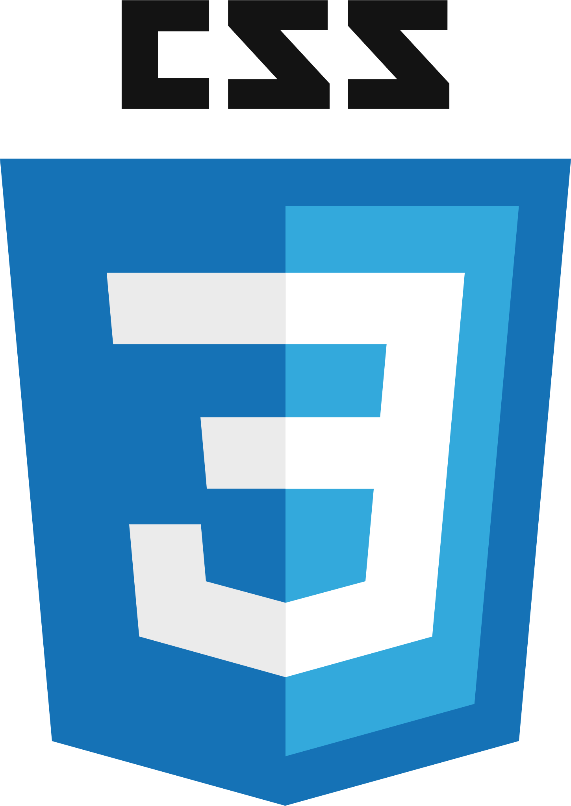

<h1 align="center"> Hi there!, I'm Lucas!!</h1>

<h4 align="center" >I love Technology, I also love learning new things and I have fun share my knowledge with people who I can.</h4>

  
  

<h2 align="center" >✉️ Contact me!</h2>
<h4 align="center" > 
  
  &nbsp;
  
  &nbsp;
  
  &nbsp;
   lucash2o2#6831
</h4>

- 🔭 I’m currently _studying_ **JavaScript**
- 🤔 I’m _looking for_ help with **Become a Better Developer** :)

# Projects

# [Ecoleta](https://github.com/Lucas-Henrique-Lopes-Costa/Ecoleta#ecoleta)
The purpose of this Web Application is to **connect** collection points and people who need one.
The points can act in the collection of: Lamp; Battery and paper stack; Electronic and organic waste and cooking oil. And they are located by the city in which they are located

## Demonstration: <a href="https://lucas-henrique-lopes-costa.github.io/Ecoleta/" target="_blank">Site Preview</a>
### USABILITY DEMONSTRATION VIDEO: 

---

# [Happy](https://github.com/Lucas-Henrique-Lopes-Costa/Happy#happy)
## Making the world happier with small actions. Do your part!

The purpose of this application is to locate the orphanages that are close to you. But the **main objective** is to get people to visit these orphanages to change the day of many children.

## Demonstration: <a href="https://lucas-henrique-lopes-costa.github.io/Happy/" target="_blank">Site Preview</a>
### USABILITY DEMONSTRATION VIDEO: 

---

# Learning...

##  

---

## 

---

## 

[Crash-Curse - Programming with Mosh](https://youtu.be/eIrMbAQSU34)

Final Project: 

[Demonstration Video](https://youtu.be/hkC5yRk3X6Q)

[Repository](https://github.com/Lucas-Henrique-Lopes-Costa/Curse-Java)

---

## 

